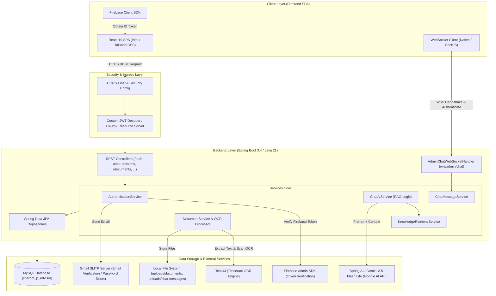
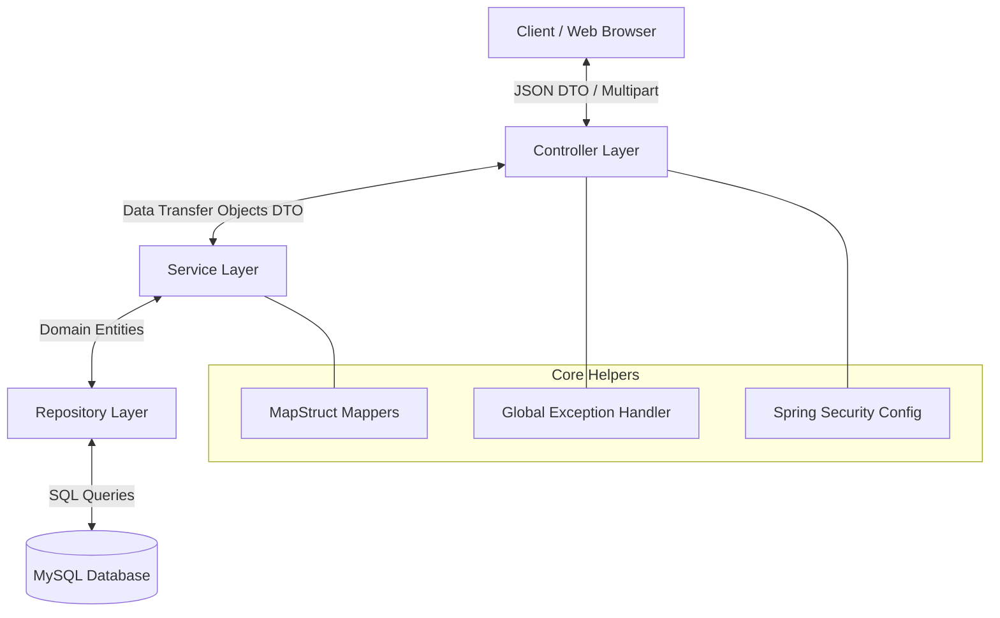
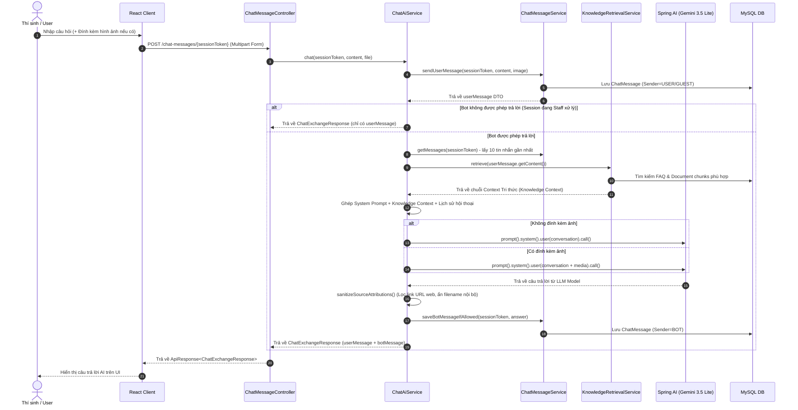
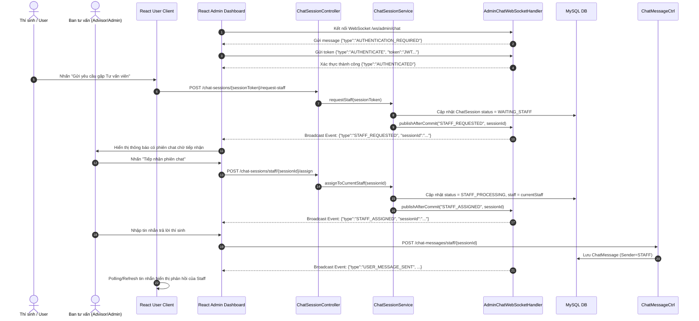
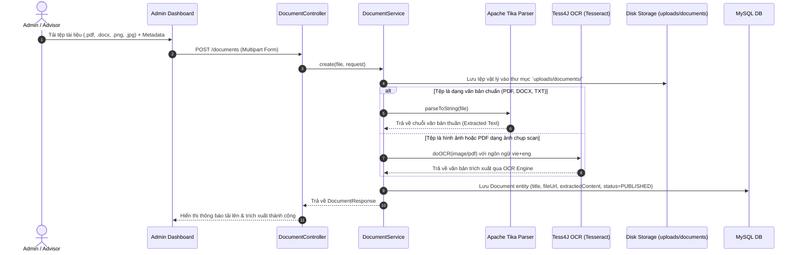
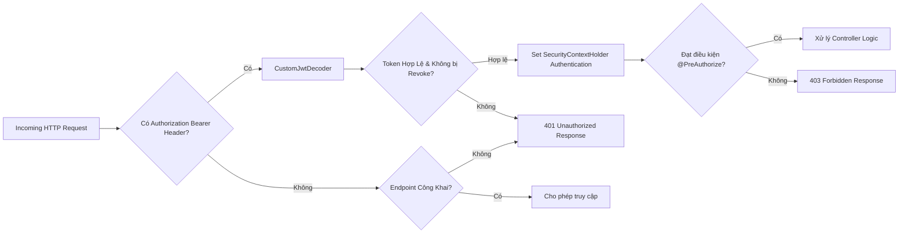

# 🏗️ Architecture Documentation - ChatBot P-Advisor

Tài liệu này mô tả chi tiết kiến trúc kỹ thuật của hệ thống **ChatBot P-Advisor**, bao gồm mô hình tổng quan các tầng ứng dụng, luồng dữ liệu, tích hợp AI RAG & OCR, kiến trúc WebSocket thời gian thực và mô hình bảo mật phân quyền.

---

## 1. Tổng Quan Kiến Trúc Hệ Thống (System Overview)

Dự án được xây dựng theo mô hình **Client-Server phân tách (Decoupled System)** với Frontend là Single Page Application (SPA) phát triển trên **React 19 + Vite**, và Backend dựa trên **Spring Boot 3.4 / Java 21** cung cấp RESTful APIs & WebSocket endpoints.

---

## 2. Kiến Trúc Phân Tầng Backend (Layered Architecture)

Backend tuân thủ nghiêm ngặt **Mô hình 3 tầng (3-Tier Layered Architecture)** nhằm đảm bảo khả năng mở rộng, bảo trì và dễ dàng kiểm thử:

1. **Controller Layer (`com.example.server.controller`)**:
   - Chỉ chịu trách nhiệm tiếp nhận HTTP Request, validate tham số đầu vào (`@Valid`), kiểm tra quyền truy cập (`@PreAuthorize`) và trả về `ApiResponse<T>`.
   - Không chứa bất kỳ logic nghiệp vụ nào.

2. **Service Layer (`com.example.server.service`)**:
   - Chứa toàn bộ Business Logic của hệ thống (Xử lý chuỗi RAG Prompt, chuyển đổi trạng thái ChatSession, trích xuất tài liệu OCR, phân công Staff).
   - Quản lý giao dịch database với annotation `@Transactional`.

3. **Repository Layer (`com.example.server.repository`)**:
   - Truy cập CSDL MySQL thông qua Spring Data JPA. Định nghĩa các hàm truy vấn tùy chỉnh (`JpaRepository`, `@Query`).

4. **DTO & Mapper Layer (`dto`, `mapper`)**:
   - Không bao giờ trả Entity trực tiếp ra Controller. Tách biệt tuyệt đối giữa `Request DTO`, `Response DTO` và `Entity` bằng **MapStruct**.

---

## 3. Các Luồng Xử Lý Chính (Sequence Flow Diagrams)

### 3.1. Luồng Chat AI với RAG & Multimodal Image/Doc Input

Luồng xử lý khi người dùng gửi câu hỏi cho Chatbot AI (có hoặc không có tệp/hình ảnh đính kèm):

---

### 3.2. Luồng Chuyển Tiếp & Chat Realtime với Ban Tư Vấn (Staff Handover)

Khi người dùng nhấn "Yêu cầu tư vấn viên" hoặc câu hỏi nằm ngoài phạm vi tri thức của Bot:

---

### 3.3. Luồng Trích Xuất Tài Liệu & Xử Lý OCR Tri Thức

Khi Ban tư vấn tải tệp văn bản hoặc hình ảnh thông báo tuyển sinh lên hệ thống:

---

## 4. Kiến Trúc Bảo Mật & Phân Quyền (Security Architecture)

Hệ thống bảo mật dựa trên nền tảng **Spring Security 6** kết hợp với chuẩn **OAuth2 Resource Server** và **JWT (JSON Web Token)**:

### Các Thành Phần Bảo Mật Chính:
1. **Custom JWT Authentication Filter & Decoder (`CustomJwtDecoder.java`)**:
   - Giải mã và xác thực chữ ký JWT bằng Secret Key (`jwt.signerKey`).
   - Kiểm tra Token xem có nằm trong bảng `invalidated_tokens` (các token đã logout) hay không.
2. **Xác Thực Đăng Nhập Firebase (`firebaseLogin`)**:
   - Tiếp nhận Firebase ID Token từ Client qua SDK Google.
   - Sử dụng **Firebase Admin SDK** để kiểm tra tính hợp lệ của token và tự động đồng bộ/tạo mới tài khoản người dùng tương ứng trong CSDL.
3. **Phân Quyền Theo Vai Trò (Method Level Security)**:
   - Sử dụng annotation `@PreAuthorize("hasRole('ADMIN')")` hoặc `@PreAuthorize("hasAnyRole('ADMIN', 'ADVISOR')")` trực tiếp tại tầng Controller để kiểm soát quyền thực thi.

---

## 5. Kiến Trúc WebSocket Realtime (`AdminChatWebSocketHandler`)

Hệ thống quản lý WebSocket cho Ban tư vấn được thiết kế chuyên biệt để đảm bảo tính sẵn sàng cao và an toàn luồng dữ liệu:

- **Authentication trên WebSocket**:
  - Không cho phép kết nối vô danh. Sau khi mở kết nối (Handshake), Client phải gửi tin nhắn đầu tiên chứa Token xác thực: `{"type": "AUTHENTICATE", "token": "<JWT_ACCESS_TOKEN>"}`.
  - Handler kiểm tra quyền hạn, nếu không phải là `ADMIN` hoặc `ADVISOR` sẽ chủ động ngắt kết nối với lý do `CloseStatus.NOT_ACCEPTABLE`.
- **Tránh Xung Đột Giao Dịch CSDL (`publishAfterCommit`)**:
  - Khi có sự kiện mới (Thí sinh gửi tin nhắn, phiên chat mới được tạo), thông báo WebSocket chỉ được gửi đi **sau khi giao dịch Database được Commit thành công** (`TransactionSynchronizationManager.registerSynchronization`).
- **An Toàn Đa Luồng (Thread Safety & Concurrency)**:
  - Tất cả các phiên WebSocket được bọc bởi `ConcurrentWebSocketSessionDecorator` với thời gian chờ ghi (Send Timeout) là `5.000ms` và dung lượng bộ đệm giới hạn `64KB` để tránh nghẽn luồng khi tin nhắn dồn dập.
