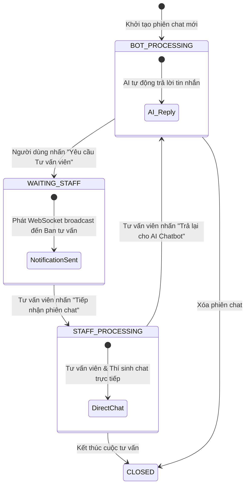

# 📜 Business Rules Documentation - ChatBot P-Advisor

Tài liệu này quy định chi tiết các quy tắc nghiệp vụ (**Business Rules**), ma trận phân quyền người dùng, luồng xử lý RAG & AI Chatbot, quy định chuyển giao cuộc trò chuyện sang tư vấn viên (Staff Handover), và các quy tắc xử lý tài liệu OCR trong hệ thống **ChatBot P-Advisor**.

---

## 1. Ma Trận Phân Quyền Theo Vai Trò (Role & Access Matrix)

Hệ thống hỗ trợ 4 cấp độ người dùng với các phạm vi truy cập được kiểm soát nghiêm ngặt qua annotation `@PreAuthorize`:

| Chức năng / Hành động | GUEST (Khách) | USER (Đã đăng ký) | ADVISOR (Tư vấn viên) | ADMIN (Quản trị) |
| :--- | :---: | :---: | :---: | :---: |
| Trò chuyện với Chatbot AI | 🟢 Hạn chế | 🟢 Không giới hạn | 🟢 Có | 🟢 Có |
| Tải ảnh đính kèm khi chat | 🟢 Có | 🟢 Có | 🟢 Có | 🟢 Có |
| Gửi yêu cầu gặp Tư vấn viên (Handover) | 🟢 Có | 🟢 Có | 🔴 Không | 🔴 Không |
| Gắn kết phiên Guest vào tài khoản | 🔴 Không | 🟢 Có | 🟢 Có | 🟢 Có |
| Xem lịch sử các phiên chat cá nhân | 🔴 Không | 🟢 Có | 🟢 Có | 🟢 Có |
| Gửi form Yêu cầu tư vấn (`ConsultationRequest`) | 🟢 Có | 🟢 Có | 🟢 Có | 🟢 Có |
| Xem câu hỏi FAQ & Danh mục xuất bản | 🟢 Có | 🟢 Có | 🟢 Có | 🟢 Có |
| Nhận & Xử lý phiên chat thời gian thực | 🔴 Không | 🔴 Không | 🟢 Có | 🟢 Có |
| Quản lý tài liệu RAG & Tải tệp OCR | 🔴 Không | 🔴 Không | 🟢 Có | 🟢 Có |
| Quản lý danh mục & Câu hỏi FAQ | 🔴 Không | 🔴 Không | 🟢 Có | 🟢 Có |
| Xử lý Yêu cầu tư vấn (`ConsultationRequest`) | 🔴 Không | 🔴 Không | 🟢 Có | 🟢 Có |
| Quản lý danh sách Người dùng & Thống kê | 🔴 Không | 🔴 Không | 🔴 Không | 🟢 Có |
| Phân quyền & Quản lý Roles | 🔴 Không | 🔴 Không | 🔴 Không | 🟢 Có |

---

## 2. Quy Tắc Quản Lý Phiên Chat Khách (Guest Chat Rules)

### 2.1. Giới Hạn Lượt Hỏi & Thời Gian Sống (Expiration)
- **Giới hạn lượt hỏi**: Phiên chat của khách chưa đăng nhập (`GUEST`) có thể bị giới hạn số lượng câu hỏi mặc định. Khi vượt quá giới hạn, hệ thống trả về mã lỗi `ErrorCode.GUEST_QUESTION_LIMIT_REACHED` (HTTP 401) yêu cầu đăng nhập.
- **Tự động dọn dẹp (Idle Cleanup)**:
  - Tất cả các phiên chat của Guest không có tương tác trong vòng **24 giờ** (`app.chat-session.guest-expiration-hours=24`) sẽ tự động bị xóa khỏi cơ sở dữ liệu bởi Cron Job chạy hàng giờ.

### 2.2. Gắn Kết Phiên Chat Vào Tài Khoản (`attachGuestSession`)
- Khi một Guest đang trao đổi với AI/Staff quyết định Đăng ký hoặc Đăng nhập tài khoản:
  - Hệ thống cho phép gọi API `POST /chat-sessions/{sessionToken}/attach`.
  - Phiên chat đó sẽ được gán `user_id` chính thức của người dùng vừa đăng nhập.
  - Toàn bộ lịch sử hội thoại trước đó của Guest được bảo lưu nguyên vẹn vào lịch sử tài khoản cá nhân.

---

## 3. Quy Tắc Trợ Lý AI & Tri Thức RAG (AI Prompting & Retrieval Rules)

### 3.1. Thứ Tự Ưu Tiên Nguồn Tri Thức (Knowledge Precedence)
1. **FAQ (Câu hỏi thường gặp)**: Khi câu hỏi của người dùng khớp trực tiếp với danh mục FAQ đã xuất bản (`PUBLISHED`), AI Assistant bắt buộc ưu tiên sử dụng câu trả lời FAQ làm câu trả lời chính.
2. **Documents (Tài liệu tri thức)**: Các tài liệu quy chế, đề án tuyển sinh được trích xuất (Tika/OCR) được dùng để bổ sung chi tiết hoặc trả lời các câu hỏi phức tạp hơn.
3. **Phản hồi khi thiếu dữ liệu**: Nếu tri thức trong hệ thống không đủ để khẳng định thông tin, AI Assistant phải nêu rõ điều đó và đề nghị người dùng gửi yêu cầu tư vấn viên hoặc để lại thông tin liên hệ.

### 3.2. Quy Tắc Bảo Mật Nội Bộ & Làm Sạch Nguồn (Sanitization Rules)
- **Ẩn đường dẫn hệ thống**: AI Assistant tuyệt đối **không** được hiển thị tên tệp tin vật lý, đường dẫn thư mục server, ID CSDL nội bộ hoặc các nhãn hệ thống dạng `"Document / ..."` hay `"FAQ / ..."`.
- **Trích xuất nguồn tham khảo Web**:
  - AI Assistant chỉ thêm phần "Nguồn tham khảo" ở cuối câu trả lời nếu trong dữ liệu tri thức truy xuất được chứa các đường dẫn trang web đầy đủ bắt đầu bằng `http://` hoặc `https://`.
  - Nếu không có URL web hợp lệ, câu trả lời tuyệt đối không chứa dòng chú thích nguồn hay bất kỳ liên kết nội bộ hỏng nào.

---

## 4. Luồng Chuyển Giao Trực Tiếp Sang Tư Vấn Viên (Staff Handover Logic)

Vòng đời chuyển đổi trạng thái của một phiên chat (`ChatSessionStatus`):

### Quy Tắc Chuyển Giao:
1. Khi trạng thái là `BOT_PROCESSING`: Tin nhắn mới của thí sinh sẽ tự động kích hoạt Spring AI trả lời.
2. Khi trạng thái chuyển sang `WAITING_STAFF` hoặc `STAFF_PROCESSING`: Chatbot AI **ngừng** tự động trả lời đối với phiên chat đó. Tin nhắn mới của thí sinh chỉ hiển thị trên bảng điều khiển của Tư vấn viên tiếp nhận.
3. Khi Tư vấn viên nhấn `Return to Bot`: Trạng thái quay trở lại `BOT_PROCESSING`, AI Assistant tiếp tục đảm nhiệm trả lời câu hỏi tự động.

---

## 5. Quy Tắc Tải Lên Tài Liệu & Nhận Diện Văn Bản OCR

1. **Định dạng tệp hỗ trợ**: `.pdf`, `.docx`, `.txt`, `.png`, `.jpg`, `.jpeg`.
2. **Giới hạn dung lượng tệp tải lên**: Tối đa **20MB** per file (`spring.servlet.multipart.max-file-size=20MB`).
3. **Giới hạn xử lý OCR**:
   - Chỉ áp dụng OCR cho tệp định dạng hình ảnh (`.png`, `.jpg`) hoặc tệp PDF dạng bản quét/ảnh.
   - Giới hạn xử lý OCR tối đa **30 trang** đối với tệp PDF scan (`app.document.ocr.max-pages=30`) để tránh gây nghẽn tài nguyên CPU.
   - Ngôn ngữ nhận diện OCR mặc định: Song ngữ Việt - Anh (`vie+eng`).

---

## 6. Quy Tắc Xác Thực Email & Đặt Lai Mật Khẩu

1. **Xác thực Email đăng ký (`EmailVerificationToken`)**:
   - Khi đăng ký tài khoản mới, hệ thống gửi email chứa Token kích hoạt.
   - Thời gian hiệu lực của Link xác thực: **24 giờ** (1440 phút).
   - Tài khoản chưa kích hoạt email sẽ không thể đăng nhập (`ErrorCode.EMAIL_NOT_VERIFIED`).

2. **Khôi phục Mật khẩu (`PasswordResetToken`)**:
   - Yêu cầu quên mật khẩu tạo Token có thời gian hiệu lực ngắn: **15 phút** (`app.config.password-reset-expiration-minutes=15`).
   - Token chỉ được sử dụng duy nhất 1 lần.
