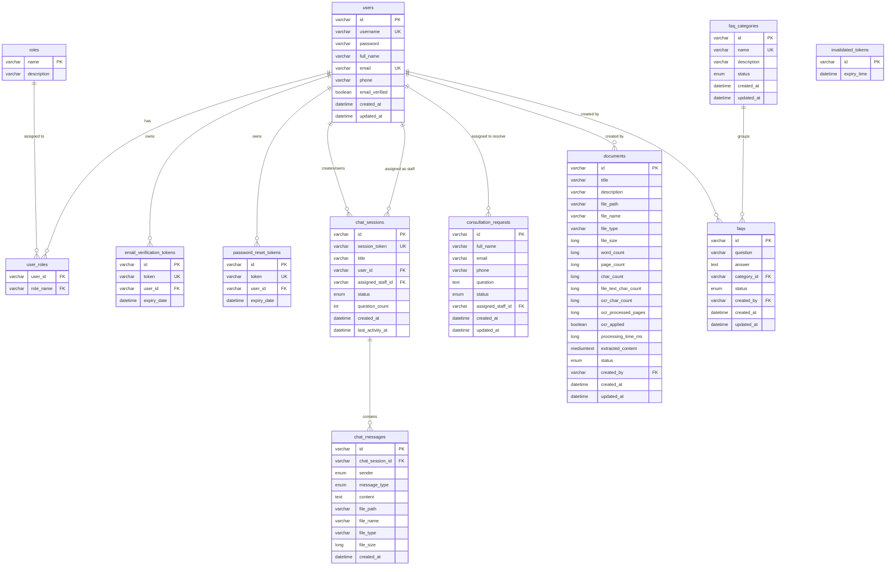

# 🗄️ Database Documentation - ChatBot P-Advisor

Tài liệu này mô tả thiết kế cơ sở dữ liệu hệ thống **ChatBot P-Advisor**, bao gồm sơ đồ quan hệ thực thể (ERD), định nghĩa chi tiết các bảng dữ liệu trong MySQL, các tập giá trị Enum, chỉ mục (Index) và chính sách dọn dẹp dữ liệu tự động.

---

## 1. Tổng Quan Cơ Sở Dữ Liệu

- **Hệ quản trị CSDL**: MySQL 8.0+
- **Database Name**: `chatbot_p_advisor`
- **Character Set**: `utf8mb4`
- **Collation**: `utf8mb4_unicode_ci`
- **Storage Engine**: `InnoDB` (Hỗ trợ ACID Transactions & Foreign Key Constraints)

---

## 2. Sơ Đồ Quan Hệ Thực Thể (ERD - Entity Relationship Diagram)

---

## 3. Mô Tả Chi Tiết Các Bảng Dữ Liệu

### 3.1. Bảng `users` (Tài khoản người dùng)
Lưu trữ thông tin tài khoản người dùng, thí sinh, tư vấn viên và quản trị viên.

| Tên trường | Kiểu dữ liệu | Constraints | Mô tả |
| :--- | :--- | :--- | :--- |
| `id` | `VARCHAR(36)` | `PRIMARY KEY` | Khóa chính (UUID v4) |
| `username` | `VARCHAR(255)` | `NOT NULL, UNIQUE` | Tên đăng nhập |
| `password` | `VARCHAR(255)` | `NULLABLE` | Mật khẩu mã hóa BCrypt (Null khi đăng nhập Firebase) |
| `full_name` | `VARCHAR(255)` | `NULLABLE` | Họ và tên hiển thị |
| `email` | `VARCHAR(255)` | `NOT NULL, UNIQUE` | Địa chỉ email |
| `phone` | `VARCHAR(50)` | `NULLABLE` | Số điện thoại liên hệ |
| `email_verified` | `BOOLEAN` | `DEFAULT false` | Trạng thái đã xác thực email hay chưa |
| `created_at` | `DATETIME` | `NOT NULL` | Thời điểm khởi tạo tài khoản |
| `updated_at` | `DATETIME` | `NOT NULL` | Thời điểm cập nhật thông tin gần nhất |

---

### 3.2. Bảng `roles` & `user_roles` (Vai trò & Phân quyền)
- **`roles`**:
  - `name` *(VARCHAR(50), PK)*: Tên vai trò (`ADMIN`, `ADVISOR`, `USER`).
  - `description` *(VARCHAR(255))*: Mô tả vai trò.
- **`user_roles`**: Bảng trung gian n-n nối `users` và `roles`.

---

### 3.3. Bảng `chat_sessions` (Phiên hội thoại Chat)
Lưu trữ các phiên chat của Guest hoặc User đăng ký với Chatbot AI / Staff.

| Tên trường | Kiểu dữ liệu | Constraints | Mô tả |
| :--- | :--- | :--- | :--- |
| `id` | `VARCHAR(36)` | `PRIMARY KEY` | UUID phiên chat |
| `session_token` | `VARCHAR(255)` | `NOT NULL, UNIQUE` | Mã Token nhận diện phiên chat ở Frontend |
| `title` | `VARCHAR(255)` | `NULLABLE` | Tiêu đề phiên chat (tự động tạo từ câu hỏi đầu) |
| `user_id` | `VARCHAR(36)` | `FOREIGN KEY (users.id)` | ID người dùng sở hữu (Null nếu là Guest) |
| `assigned_staff_id` | `VARCHAR(36)` | `FOREIGN KEY (users.id)` | ID tư vấn viên tiếp nhận (Null khi AI chat) |
| `status` | `VARCHAR(50)` | `NOT NULL` | Trạng thái phiên (`BOT_PROCESSING`, `WAITING_STAFF`, `STAFF_PROCESSING`, `CLOSED`) |
| `question_count` | `INT` | `DEFAULT 0` | Số câu hỏi Guest đã thực hiện |
| `created_at` | `DATETIME` | `NOT NULL` | Thời gian khởi tạo |
| `last_activity_at` | `DATETIME` | `NOT NULL` | Thời gian tương tác gần nhất |

---

### 3.4. Bảng `chat_messages` (Tin nhắn nội dung Chat)
Lưu trữ từng tin nhắn cụ thể trong phiên chat (Text hoặc File/Ảnh đính kèm).

| Tên trường | Kiểu dữ liệu | Constraints | Mô tả |
| :--- | :--- | :--- | :--- |
| `id` | `VARCHAR(36)` | `PRIMARY KEY` | UUID tin nhắn |
| `chat_session_id` | `VARCHAR(36)` | `FOREIGN KEY` | ID phiên chat tương ứng |
| `sender` | `VARCHAR(50)` | `NOT NULL` | Người gửi (`GUEST`, `USER`, `BOT`, `STAFF`, `SYSTEM`) |
| `message_type` | `VARCHAR(50)` | `NOT NULL` | Loại tin nhắn (`TEXT`, `FILE`, `IMAGE`) |
| `content` | `TEXT` | `NOT NULL` | Nội dung tin nhắn văn bản |
| `file_path` | `VARCHAR(500)` | `NULLABLE` | Đường dẫn tệp đính kèm trên Server |
| `file_name` | `VARCHAR(255)` | `NULLABLE` | Tên gốc của tệp đính kèm |
| `file_type` | `VARCHAR(100)` | `NULLABLE` | Định dạng MIME Type của tệp |
| `file_size` | `BIGINT` | `NULLABLE` | Dung lượng tệp tính bằng Bytes |
| `created_at` | `DATETIME` | `NOT NULL` | Thời điểm gửi tin nhắn |

---

### 3.5. Bảng `documents` (Tài liệu tri thức RAG & OCR)
Lưu trữ các tệp văn bản quy chế, đề án tuyển sinh được tải lên và trích xuất nội dung.

| Tên trường | Kiểu dữ liệu | Constraints | Mô tả |
| :--- | :--- | :--- | :--- |
| `id` | `VARCHAR(36)` | `PRIMARY KEY` | UUID tài liệu |
| `title` | `VARCHAR(255)` | `NOT NULL` | Tiêu đề tài liệu |
| `description` | `VARCHAR(500)` | `NULLABLE` | Mô tả ngắn gọn |
| `file_path` | `VARCHAR(500)` | `NOT NULL` | Đường dẫn lưu tệp vật lý |
| `extracted_content` | `MEDIUMTEXT` | `NULLABLE` | Toàn bộ văn bản trích xuất từ Apache Tika / Tess4J OCR |
| `word_count` | `BIGINT` | `DEFAULT 0` | Tổng số từ trong tài liệu |
| `page_count` | `BIGINT` | `DEFAULT 0` | Số trang (đối với PDF/DOCX) |
| `ocr_applied` | `BOOLEAN` | `DEFAULT false` | Đánh dấu tệp có qua nhận diện OCR hay không |
| `status` | `VARCHAR(50)` | `NOT NULL` | Trạng thái tài liệu (`PUBLISHED`, `DRAFT`, `ARCHIVED`) |
| `created_by` | `VARCHAR(36)` | `FOREIGN KEY` | ID người tạo (Admin/Staff) |

---

### 3.6. Bảng `faq_categories` & `faqs` (Danh mục & Câu hỏi thường gặp)
- **`faq_categories`**:
  - `id` *(VARCHAR(36), PK)*, `name` *(VARCHAR(100), UK)*, `description` *(VARCHAR(255))*, `status` *(PUBLISHED/DRAFT)*.
- **`faqs`**:
  - `id` *(VARCHAR(36), PK)*, `question` *(VARCHAR(500))*, `answer` *(TEXT)*, `category_id` *(FK)*, `status` *(PUBLISHED/DRAFT/ARCHIVED)*.

---

### 3.7. Bảng `consultation_requests` (Đăng ký yêu cầu tư vấn)
Lưu trữ form thí sinh đăng ký tư vấn trực tiếp với Học viện.
- `id` *(PK)*, `full_name`, `email`, `phone`, `question` *(TEXT)*, `status` *(`PENDING`, `ASSIGNED`, `RESOLVED`)*, `assigned_staff_id` *(FK)*.

---

## 4. Chi Tiết Tập Giá Trị Enums

1. **`Role`**: `ADMIN`, `ADVISOR`, `USER`
2. **`ChatSessionStatus`**:
   - `BOT_PROCESSING`: AI đang tự động trả lời.
   - `WAITING_STAFF`: Thí sinh yêu cầu gặp Ban tư vấn, đang chờ Staff nhận.
   - `STAFF_PROCESSING`: Tư vấn viên đang chat trực tiếp với thí sinh.
   - `CLOSED`: Phiên hội thoại đã đóng.
3. **`ChatMessageSender`**: `GUEST`, `USER`, `BOT`, `STAFF`, `SYSTEM`
4. **`ChatMessageType`**: `TEXT`, `FILE`, `IMAGE`
5. **`DocumentStatus` / `FaqStatus`**: `PUBLISHED`, `DRAFT`, `ARCHIVED`
6. **`ConsultationRequestStatus`**: `PENDING`, `ASSIGNED`, `RESOLVED`

---

## 5. Chiến Lược Đánh Chỉ Mục (Indexes) & Dọn Dẹp Tự Động

### 5.1. Chỉ Mục Hiệu Năng (Indexes)
- **`chat_sessions`**: Index trên `(session_token)`, `(user_id)`, `(status, created_at)`.
- **`chat_messages`**: Index trên `(chat_session_id, created_at)`.
- **`documents`**: Index trên `(status, updated_at)`.
- **`faqs`**: Index trên `(category_id, status)`.

### 5.2. Cron Job Dọn Dẹp Dữ Liệu Tự Động (Scheduled Maintenance)
- **Dọn dẹp phiên chat Guest hết hạn**:
  - Mặc định chạy hàng giờ: `@Scheduled(cron = "${app.chat-session.cleanup-cron:0 0 * * * *}")`.
  - Tự động xóa tất cả các phiên chat của **Guest** không có hoạt động trong vòng **24 giờ** (`last_activity_at < NOW() - 24 hours`).
- **Dọn dẹp Token thu hồi (`invalidated_tokens`)**:
  - Xóa các JWT token đã quá thời hạn refreshable khỏi CSDL để giải phóng dung lượng.
